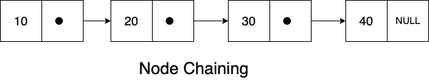

# Data Structures and Algorithms

## 1. Array
An array is a data structure that stores a group of elements of same data type in contiguous memory locations.

    

## 2. List ADT
A list is a sequence of items of the same data type, where the order of the item’s position matters. In order to implement the list abstract data type, we need to think about - what type of data we want to store and what operations we want to support / perform on the data. The operations that we want to support -

1. Get(i) - fetch the element at the i index if it exists, unless return -1
2. Insert(i, v) - insert the element of value v at the i index
3. Remove(i) - removes the item in the i index
4. Search(v) - returns the index of first occurrence of v (if the v value doesn’t exist, the return value is - 1)
5. Count() - returns the count of the total number of elements in the list
6. List() - constructor that initialises a list
7. ~List() - frees up the memory when the list is not in use

For the simplicity, we are going to store elements of int data type.

## 3. Node
Node is one of the basic building blocks of many data structures in C++ such as linked list, binary search tree etc. Node has functions - one is to store the value and the other is to store the object reference pointer, a pointer to the next node.

    

## 4. Singly Linked List
A singly linked list is a collection of nodes in which each and every node has a value and a pointer to the next node. In a singly linked list, we also have a pointer pointing to the head node and other pointer pointing to the tail node. That will make the insertion and removal at the front and the end of the list will be constant time. Inserting a node in the middle will be linear time similar to the the list data structure. Fetching a node will be linear time as well because we need to start from the head node and iterate over all the way to the destination node.

    

