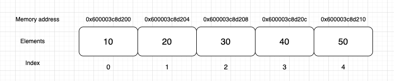

# Data Structures and Algorithms

## 1. Array
An array is a data structure that stores a group of elements of same data type in contiguous memory locations.

## 2. List ADT
A list is a sequence of items of the same data type, where the order of the item’s position matters. In order to implement the list abstract data type, we need to think about - what type of data we want to store and what operations we want to support / perform on the data. The operations that we want to support -

1. Get(i) - fetch the element at the i index if it exists, unless return -1
2. Insert(i, v) - insert the element of value v at the i index
3. Remove(i) - removes the item in the i index
4. Search(v) - returns the index of first occurrence of v (if the v value doesn’t exist, the return value is - 1)
5. Count() - returns the count of the total number of elements in the list
6. List() - constructor that initialises a list
7. ~List() - frees up the memory when the list is not in use

For the simplicity, we are going to store elements of int data type.